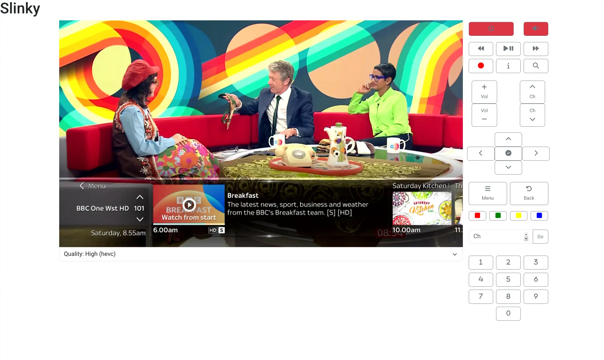

# Slinky

A homemade alternative to a Slingbox.

I used to love my Slingbox back in the day. They killed it over and over (ads, web client, ...), and finally killed it for good by shutting down the servers.

I've long wanted to build my own replacement and this is kind of step #1. It's very much a passion-project and something I use quite a bit when traveling.

## Dependencies

You will require a means to create the stream and a web server:

1. [URayCoder HD](https://www.amazon.co.uk/gp/product/B07D78L3SZ/ref=ppx_yo_dt_b_asin_title_o01_s00) or similar product
2. [Nginx](https://www.nginx.com/) or some kind of reverse proxy if you wish to watch video in your browser

You will also need a way to control your external device - currently Slinky supports controlling [Sky TV boxes](https://www.sky.com/tv/sky-q) (a UK TV service provider) directly or sending commands via a [Logitch Harmony Hub](https://www.logitech.com/en-gb/products.html).

### Additional Logitech Harmony requirements

**Note:** You only require this if you do not plan to stream from a Sky Q TV box

1. [Logitch Harmony Hub](https://www.logitech.com/en-gb/products.html) - this controls the remote, activities etc
2. [Harmony API](https://github.com/maddox/harmony-api) - a REST API to control the Harmony hub
   that streams H.264/H.265 video. You can find an example docker-compose file in `samples/harmony-api/docker-compose.yaml`

## Setup

Assuming you have the dependencies working, you can deploy slinky using `samples/docker-compose.yaml`.

There are some configuration paramters you can change via `config/config.yaml` or environment variables (see below).

Once running you can go to `/` for a live video view, or `/remote` for a remote control.

### Reverse proxy

To make this work on the internet I strongly recommend using a reverse proxy and some kind of SSO. `samples/nginx/slinky.example.conf` is a basic implementation. For my own personal use, I combine this with [Nginx SSO by Luzifer](https://github.com/Luzifer/nginx-sso).

## Configuration

### Basic config

| Config    | Environment Variable | Description                                                                | Example        |
| --------- | -------------------- | -------------------------------------------------------------------------- | -------------- |
| `port`    | `PORT`               | Port for this service to listen on                                         | `PORT=8080`    |
| `control` | `CONTROL`            | Whether Slinky controls via `harmony` or `skyq` APIs (default: `harmony`). | `CONTROL=skyq` |

### Configure Sky Q

**Note**: This section is optional and can be omitted if you're using a Harmony Hub (`control` set to `harmony`).

| Config       | Environment Variable | Description                                                           | Example                  |
| ------------ | -------------------- | --------------------------------------------------------------------- | ------------------------ |
| `sky_q.host` | `SKY_Q.HOST`         | Your Sky Q box's host IP address or hostname                          | `SKY_Q.HOST=10.86.0.205` |
| `sky_q.port` | `SKY_Q.PORT`         | The port to connect to your Sky Q Box (will almost always be `49160`) | `SKY_Q.PORT=49160`       |

### Configure Harmony API

**Note**: This section is optional and can be omitted if you're using Sky Q (`control` set to `skyq`).

Configure the [Harmony API](https://github.com/maddox/harmony-api) and how it should connect.

| Config                         | Environment Variable           | Description                                                 | Example                                 |
| ------------------------------ | ------------------------------ | ----------------------------------------------------------- | --------------------------------------- |
| `harmony_api.url`              | `HARMONY_API.URL`              | Where the Harmony API is running                            | `HARMONY_API.URL=http://localhost:8282` |
| `harmony_api.default_hub`      | `HARMONY_API.DEFAULT_HUB`      | The hub to connect to (future versions may allow more flex) | `HARMONY_API.DEFAULT_HUB=living-room`   |
| `harmony_api.default_activity` | `HARMONY_API.DEFAULT_ACTIVITY` | The activity to use (future versions may allow more flex)   | `HARMONY_API.DEFAULT_ACTIVITY=watch-tv` |

### Streaming

Configure the built-in video stream

| Config        | Environment Variable | Description                                                                                       | Example             |
| ------------- | -------------------- | ------------------------------------------------------------------------------------------------- | ------------------- |
| `stream.hq`   | `STREAM.HQ`          | The default HQ stream URL to use                                                                  | `STREAM.HQ=/0.ts`   |
| `stream.fast` | `STREAM.FAST`        | Unused today, but future versions may switch to the fast stream when using the remote for example | `STREAM.FAST=/1.ts` |

### Dev

When developing locally CORS will stop you from directly streaming the video source into the browser. Go has some very simple reverse proxy features to allow this, but we don't wanna run this in production - so useful for local IDE development.

If you enable this, you should set `STREAM.HQ=/<x>.ts`.

| Config        | Environment Variable | Description                                       | Example                            |
| ------------- | -------------------- | ------------------------------------------------- | ---------------------------------- |
| `dev.enabled` | `DEV.ENABLED`        | Whether to enable Dev mode (reverse proxy) or not | `DEV.ENABLED=true`                 |
| `dev.stream`  | `DEV.STREAM`         | Your stream URL to proxy                          | `DEV.STREAM=http://192.168.1.168/` |

## Future plans

When created I was a backend developer and had no clue about UI, UX, etc. If I were to do this again, I'd rewrite it in React + Next.js and definitely not as a weird hybrid with a Go backend and handcrafted js in the frontend.

Much of the code was refactored in 2025 with the help of Gemini. Still not how I'd write it from scratch but much better than it was.

### Wishlist

#### More beautiful UI

It's using Bootstrap today and even then barely. It works - you stick the video in fullscreen and move on. Doesn't mean it can't be more beautiful though.

#### Popup remote in fullscreen

I had a go at getting AI to do this once. Didn't work. Will try again one day. It would be very cool to have the remote show in fullscreen and the video controls actually control your remote device.

#### All-in-one distribution

Something like a Docker image for a Raspberry Pi would be pretty cool for minimal setup and configuration which would include nginx and so on out of the box.

#### HLS

I would love this to auto-select quality and be more seamless, but it simply adds too much latency. I don't know if changes in the future will improve this. Something to keep an eye on.

#### More remote options

Would be cool to integrate into something even simpler for remote config
